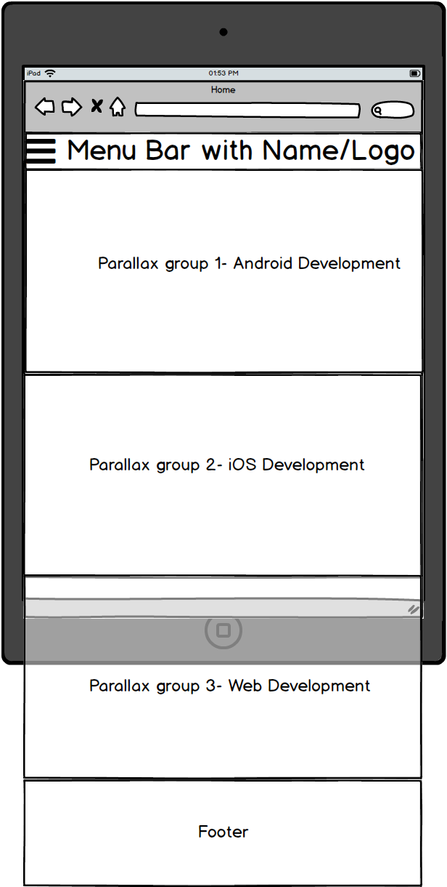
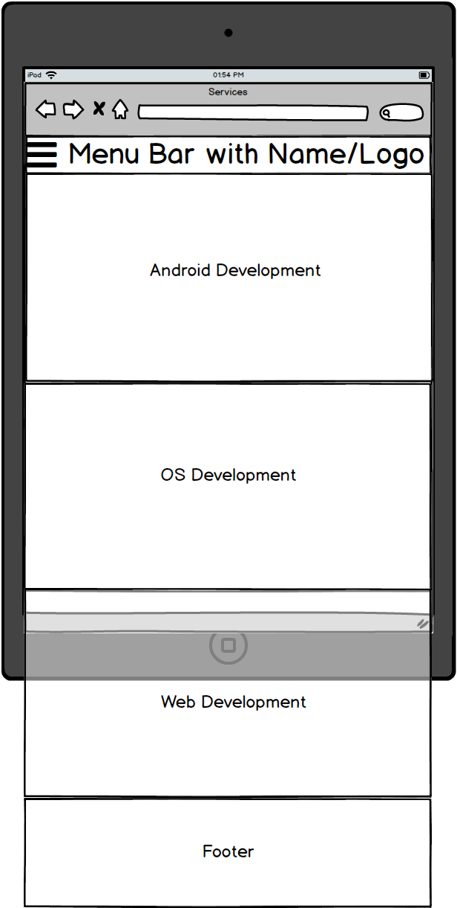
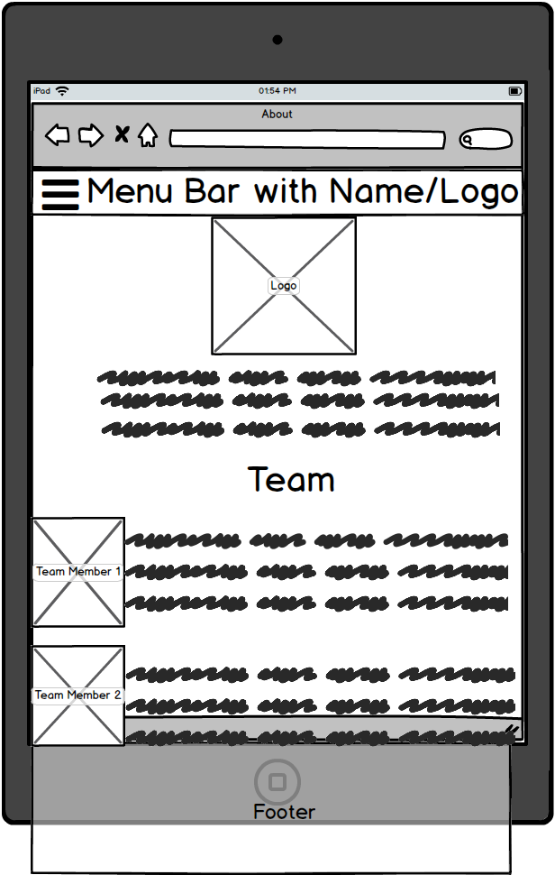
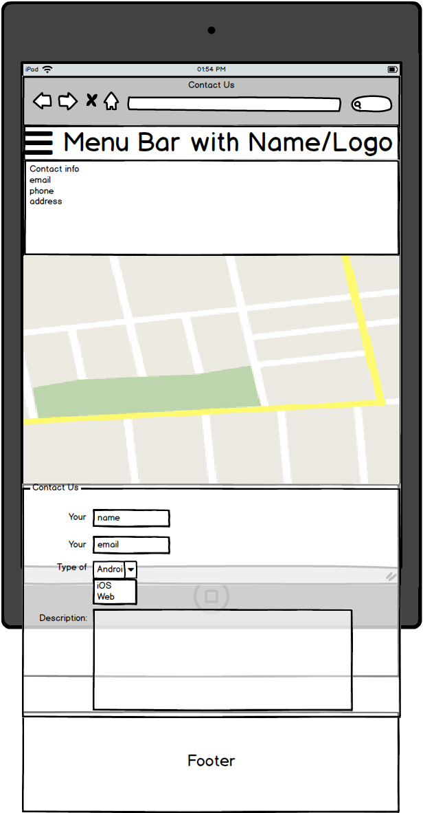
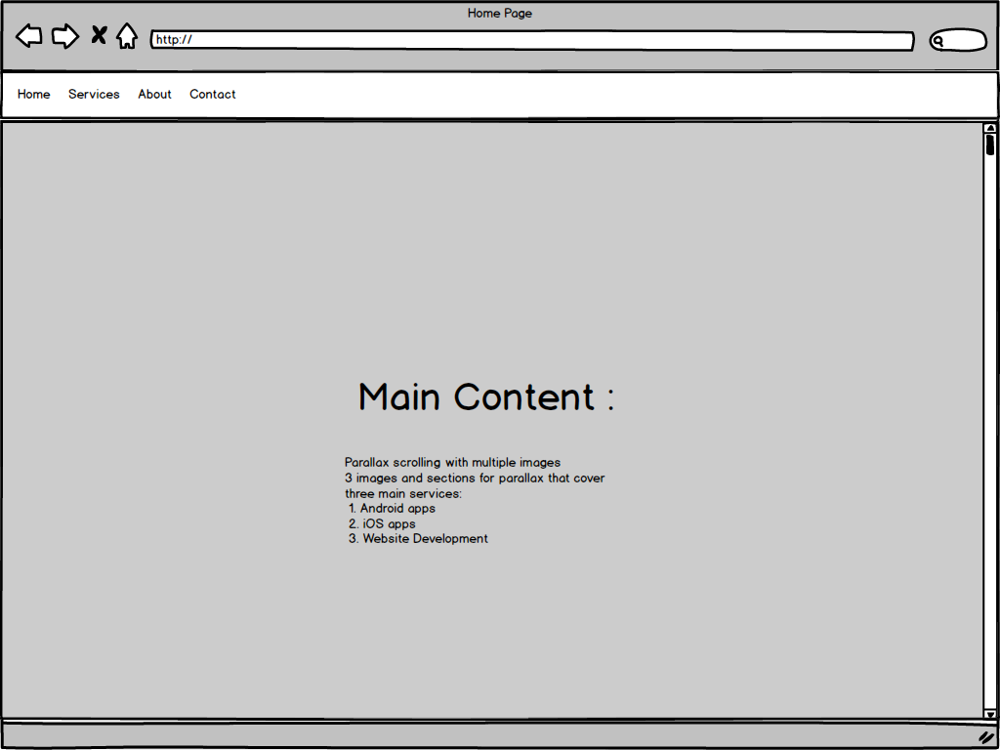
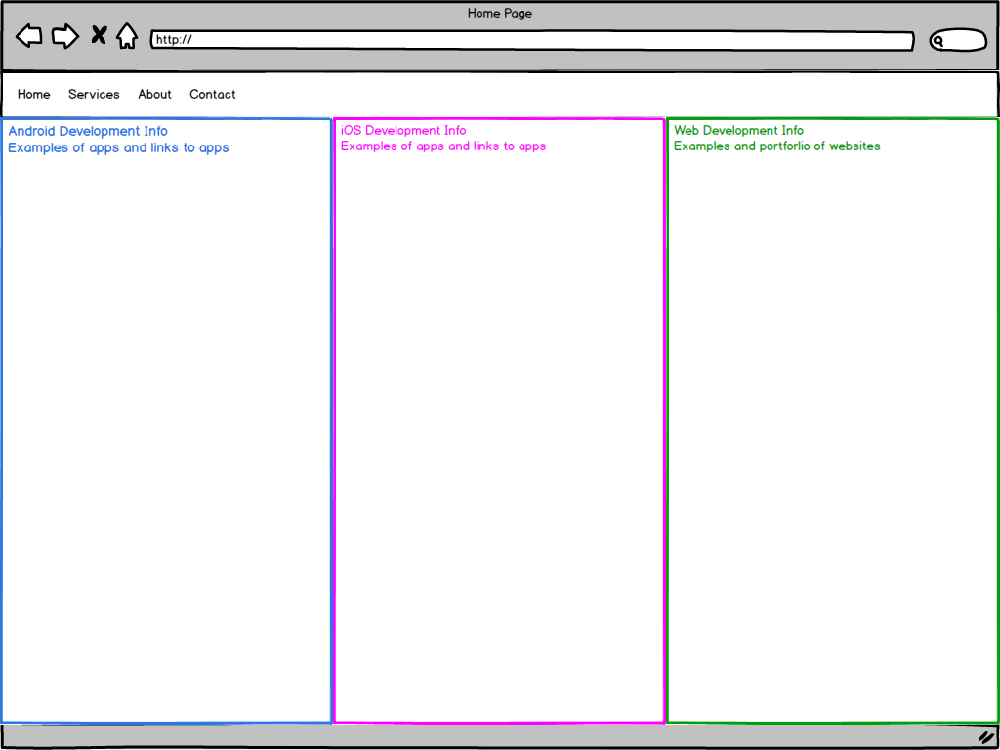
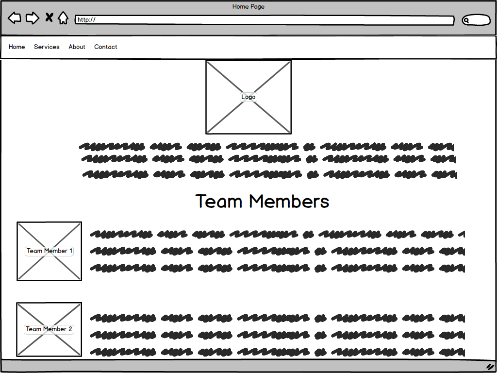
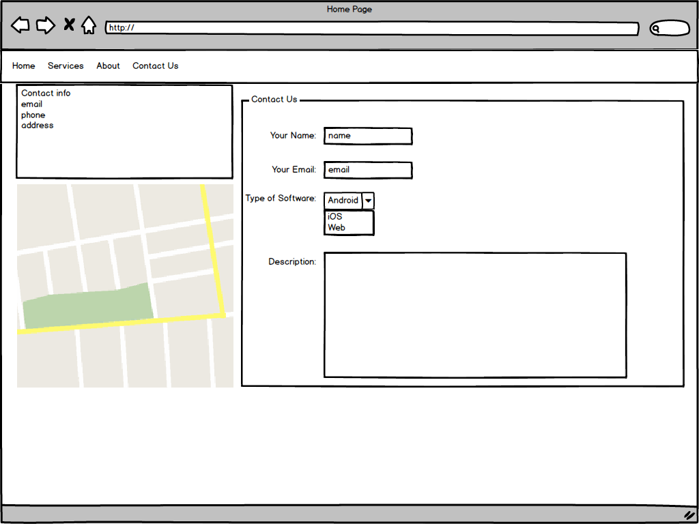

# Final Site Summary
### by Scott LaForest

### Design Process:
1. ~~Determine main topic and site map.~~ 4/26/17
2. ~~Design wireframe mock ups for both desktop and mobile.~~ 4/28/17
3. ~~Program code for mobile layout and design.~~ 5/2/17
4. ~~Look for ways to improve design and development of mobile site.~~ 5/2/17
5. ~~Program responsiveness for desktop especially parallax home page.~~ 5/4/17
6. ~~Improve desktop form and function.~~ 5/4/17
7. Test on Firefox, Safari, and Chrome for desktop.
8. Test Safari and Chrome on mobile.

### Site Topic:
I chose to develop my site for the final as a hypothetical, possibly realistic, business
opportunity. I have experience with mobile development as well as some web development while my
wife has design experience and skills. It is a slight possibility that we could start
a web and mobile development company that would allow both of us to utilize our skills and
hobbies. The name of this venture will be called, for now, Sentinel Studios.

The site itself will have four main sections including home, services, about, and
contact pages. The color palette again follows the Material Design palette using simple colors
with primary blue as well as dark primary blue mixed with green accents. The font and overall
design will be minimalist and non-distracting.

### Wireframe Mockups
Originally I thought about designing for three different screen sizes of phone, tablet,
and desktop. However after going through the design process for the phone and tablet I
didn't see much of a difference so I narrowed it down to two very different designs.

First on mobile all the way up to screen-width of 768px I will have a simplified
design using flex boxes and media queries to align the various content in the way that
I want. It will be a mostly fluid responsive design with the four different pages looking
similar to the wireframes below. I used a free (30 day trial) and excellent piece of software for all of my mockups called [Balsamiq](https://balsamiq.com/)

The desktop design will be drastically different with a parallax enabled home page
and the rest of the pages drastically rearranging their layout. The mockups using Balsamiq are
provided below.

### Develop Mobile Layout
- The first problem that I ran into was getting the menu bar to align correctly. I wanted the menu bars
icon to be left aligned, the title centered, and the logo right aligned. I ended up using flex box
with `justify-content: center` and the title and logos with `margin-left: auto`. This provided the look I wanted and formed the basis for my responsive design.
- Ran into problems with using em units for font-size of my elements. Apparently em are relative for example if a
container is 2em and an inner div is 3em, the inner div is actually 6em (2*3). Had to go through and readjust my font-sizes.

### Test and Refine Mobile Layout
- Using Chrome's [device mode](https://developers.google.com/web/tools/chrome-devtools/device-mode/) in Chrome dev tools really saved a lot of time when testing my site in mobile and tablet.

### Develop Desktop Layout
- Adding parallax was actually not too bad. I was afraid that this would be hard but just using a fake parallax method was
quite easy. I ended up using a different image for the second background and just hid the others in my media query using `display:none`. This might not be the most efficient method but it accomplished what I needed.
- I spent a lot of time trying to get the layout to work correctly on the services page as I attempted to rearrange the different services in a 2x2 grid. I ended up changing the class to `justify-content:flex-start` to accomplish this.

### Test and Refine Desktop Layout
Works on Chrome on the desktop.

- Had to fix team member image to be an id so it will only work on the about page as the imgLeft class needed to be
different on the about page and contact page. 

### Test on Various Browsers and Finalize Website
TODO
