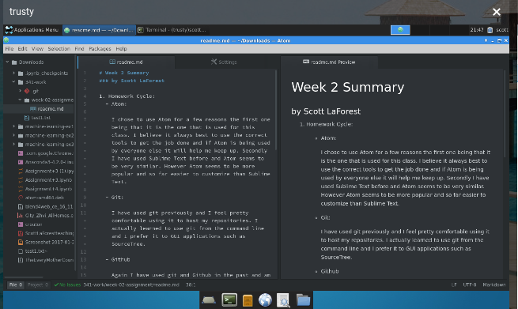

# Week 2 Summary
### by Scott LaForest

1. Homework Cycle:
  - Atom:

    I chose to use Atom for a few reasons the first one being that it is the one that is used for this class. I believe it always best to use the correct tools to get the job done and if Atom is being used by everyone else it will help me keep up. Secondly I have used Sublime Text before and Atom seems to be very similar. However Atom seems to be more popular and so far easier to customize than Sublime Text.

  - Git:

    I have used git previously and I feel pretty comfortable using it to host my repositories. I actually learned to use git from the command line and I prefer it to GUI applications such as SourceTree.

  - Github

    Again I have used git and Github in the past and am excited to learn more about it. There are other alternatives ([BitBucket](https://bitbucket.org/), [GitLab](https://about.gitlab.com/)) but they are neither as popular nor, in my experience, as straight forward as Github.

2. Steps for completing this week:
  3. Download Atom
  4. Install newbound-dark-syntax theme (make sure to select it in the ** Settings --> Themes --> Syntax Theme --> Newbound Dark **)
  5. Installed specific packages from [lesson 3 in week 2](https://montana-media-arts.github.io/mart341-webDev/modules/week-2/texteditor/)
  6. Created the example test1.txt file in my 341-work folder
  7. Opened test1.txt in Atom and added new text
  8. Saved the file and initiated a new git repository
  9. Went to github.com and created my new directory
  10. Typed the following code into my terminal

      ```bash
      /341-work/$ git commit -m "Initial commit"
      /341-work$ git remote add origin https://github.com/scottyla19/341-work.git
      /341-work$ git push -u origin master

      ```
  11. Created this file in a new folder on my local machine and then I will push to github again.

3. I did not have any problems with this assignment.
4. Having finally found another reason to get back into web design and development and getting to know Atom at a very basic level was fantastic. I used Sublime in the past but Atom is superb since I already feel like I am better with it than I was with Sublime. Also it is free and open source which is one of my personal preferences when it comes to software.
5. Sadly I have not helped any fellow students this past week.



